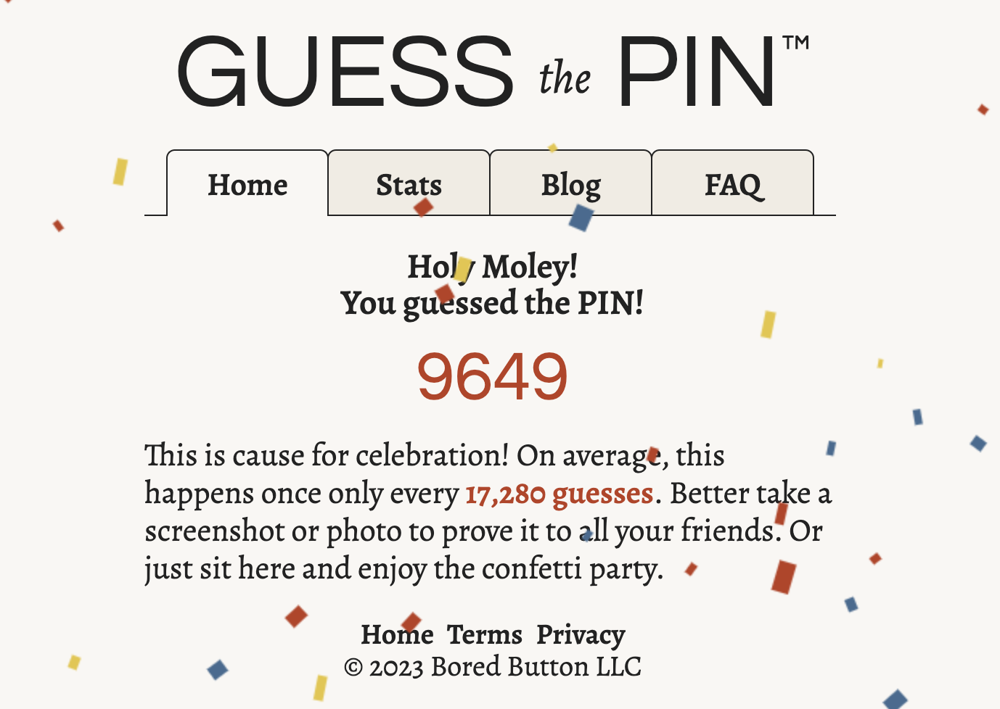

# Automations

These are some automation files that are supposed to make my life a little easier.

There are also some random scripts that I wrote when I was bored.
For example the [pins game](./games/pins.py), a game I found on the [Bored Button website](https://boredbutton.com/),
where you need to guess the 4 digit pin code. I wrote a brute force script for this, just for fun! :)

